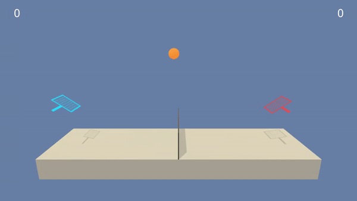
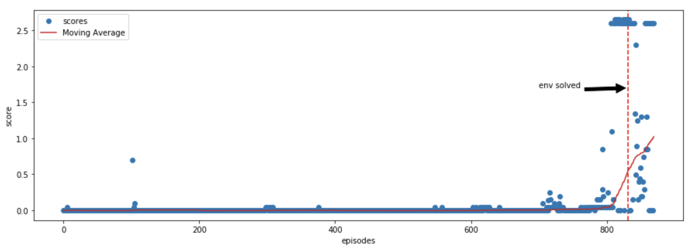

# Tennis

Unity Machine Learning Agents (ML-Agents) is an open-source Unity plugin that enables games and simulations to serve as environments for training intelligent agents.

For game developers, these trained agents can be used for multiple purposes, including controlling NPC behavior (in a variety of settings such as multi-agent and adversarial), automated testing of game builds and evaluating different game design decisions pre-release.

## The Environment

In this environment, two agents control rackets to bounce a ball over a net. If an agent hits the ball over the net, it receives a reward of +0.1. If an agent lets a ball hit the ground or hits the ball out of bounds, it receives a reward of -0.01. Thus, the goal of each agent is to keep the ball in play.

The observation space consists of 8 variables corresponding to the position and velocity of the ball and racket. Each agent receives its own, local observation. Two continuous actions are available, corresponding to movement toward (or away from) the net, and jumping.

The task is episodic, and in order to solve the environment, your agents must get an average score of +0.5 (over 100 consecutive episodes, after taking the maximum over both agents). Specifically,

- After each episode, we add up the rewards that each agent received (without discounting), to get a score for each agent. This yields 2 (potentially different) scores. We then take the maximum of these 2 scores.
- This yields a single score for each episode.



The environment is considered solved, when the average (over 100 episodes) of those scores is at least +0.5.

## Installation

Use the [docker](https://www.docker.com) to test the algorithm.

```bash
docker pull fernandofsilva/reacher 
```


## Usage

Run the container to start the jupyter notebook server

```bash
docker run -t -p 8888:8888 fernandofsilva/tennis 
```

And you can access the notebook through the link is provided.

To train the agent with different parameters, you just need to access the notebook, change the parameters on the sections
4.1 and 4.2 and check the results on section 4.3.


## Scores

Below, there are the scores during training of the neural network, the environment was solved in the episode 831 (between the episode 731 and 831 the average return were above 0.5). 




## Contributing

Pull requests are welcome. For major changes, please open an issue first to discuss what you would like to change.


## License

[MIT](https://choosealicense.com/licenses/mit/)